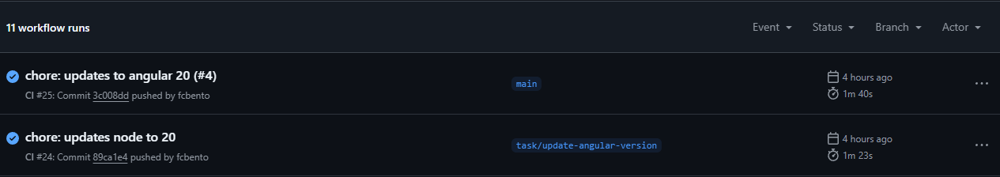
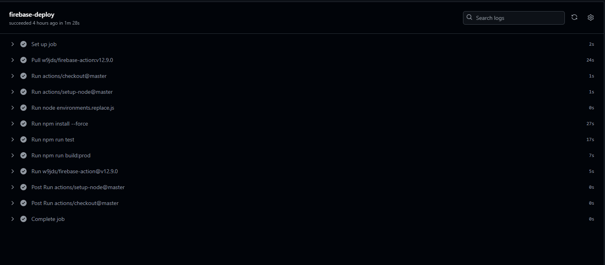
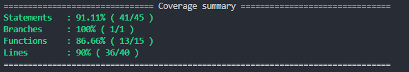
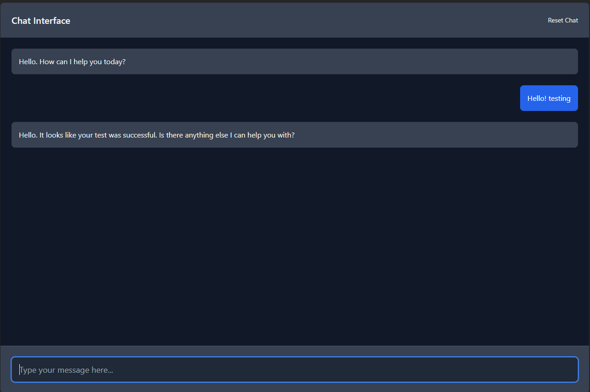

# Integration with GroqAI - Angular 20 

A chat application built using Angular 20. It works like any AI chat, allowing users to chat in real time with an AI. The application is connected to GroqAI, an AI service that understands and generates natural language, providing quick responses to user messages. This project was created to practce some of the new Angular features and understand a bit how AI services provide messages to the client.

## Live preview

https://ai-chat-7c843.web.app/

## Prerequisites

Requirements for running the app locally
- [Node](https://nodejs.org/)
- [Npm](https://www.npmjs.com/)

## How to use

**Required**: A Groq apiKey to fill the groq object in **environments.ts**

https://console.groq.com/

Example: 

```bash
  groq: {
    apiKey: 'YOUR_API_KEY',
    dangerouslyAllowBrowser: true,
    model: 'llama-3.3-70b-versatile',
    role: 'user'
  }
```

```bash
# Clone this repository
$ git clone https://github.com/fcbento/angular-20-groqai-signals-deferrable-views.git

# Go into the repository
$ cd angular-20-groqai-signals-deferrable-views

# Install dependencies
$ npm install

# Run the app
$ ng serve

# Unit tests
$ npm run test

```

## How It Works

- User enters a message in the chat input.
- The message is emitted and added to the chat history.
- The AI service is called for a response.
- The AI's response is added to the chat history.

## CI / CD

This project uses **GitHub Actions** for continuous deployment to **Firebase Hosting**. Whenever changes are pushed to the main branch, a GitHub Actions workflow automatically builds and deploys the latest version to Firebase. Also runs unit tests on every push and pull request. Check folder: **.github/workflows**




## Tests Coverage



## Chat input message



## TODO

- [ ] Enhance UI
- [ ] Delay incoming messages from the server

## Built With

This was created with the following tech stack.

[](https://skillicons.dev)

## Top contributors

<a href="https://github.com/fcbento/angular-20-groqai-signals-deferrable-views/graphs/contributors">
  
</a>

## Contact

[](https://linkedin.com/in/felipe-bento)
[](https://discordapp.com/users/413141379074490369)
[](mailto:felipe.16costa@gmail.com)